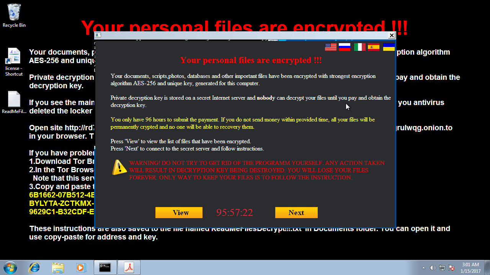

Hello Malware
=============

Now that all the pieces are in place, we can finally proceed with the analysis of our first malicious sample.

Please bear in mind that executing unknown software is dangerous. Sandboxing provides a mean of isolation which is all but effective against specifically crafted code. Other implied risks derive from User's misconfigurations. Furthermore, the explicit handling and execution of malicious software might be restricted by the law.

Analysis Scenario
-----------------

The sample we are about to execute is a simple ransomware. Ransomware are good analysis candidates because they show a quite complete set of malicious behaviour.

We will adopt the execution Protocol shown in the chapter `Plugins and Protocol`. In addition to that, we will use some of the provided `example plugins <https://github.com/F-Secure/see/tree/master/plugins>`_.

It might be necessary to apply further changes within the Guest Operating System. Services such as the Windows Firewall and Windows Defender might prevent the samples from showing their full behaviour.

Behavioural analysis
--------------------

The behavioural analysis is usually divided in two stages. The first stage takes care of acquiring the behavioural data while the Sandbox is executing. The second stage, which will take place at the end of the Sandbox execution, will analyse the collected data and produce a report.

Disk behaviour
++++++++++++++

The disk behaviour is gathered by taking two snapshots of the disk, before and after the sample execution. Once done, we compare the two snapshots extracting all the occurred changes.

The disk behaviour logic is contained within the `disk plugin <https://github.com/F-Secure/see/blob/master/plugins/disk.py>`_. The `DiskCheckPointHook` takes care of collecting the disk snapshots. We will configure it to take two snapshots at the `ip_address` and at the `post_poweroff` Events occurrence. This will allows a good coverage of the changes reducing a bit the noise. The `DiskStateAnalyser` will take care of analysing the snapshots. As the analysis is asynchronous, we need to specify when to start it and when to wait for its conclusion. The protocol's `start_analysis` and `wait_analysis` Events suit our needs.

The report will be stored in the path given as `results_folder` with the file name `filesystem.json`. It will contain information about created, deleted and modified files and Windows registry keys.

Memory behaviour
++++++++++++++++

The memory behaviour is gathered by taking a memory snapshot of the running virtual machine. The memory snapshot will be analysed using Volatility.

The memory behaviour logic is contained within the `memory plugin <https://github.com/F-Secure/see/blob/master/plugins/memory.py>`_. The `MemoryHook` takes care of collecting the memory snapshots. We will configure it to take a single snapshot at the `snapshots_capture` Event occurrence. The `VolatilityHook` will take care of analysing the snapshot. As for the Disk analysis hook, the analysis is asynchronous.

Furthermore, the `VolatilityHook` requires a profile to be specified and a set of scanning plugins to use. As we are running a Windows 7 32 bit, the `Win7SP1x86` profile is the one to be used. For the plugins, we can select the `mutantscan` and the `psscan` ones.

The `VolatilityHook` will generate a report file per each Volatility plugin. The reports will be stored in the path given as `results_folder`.

Network behaviour
+++++++++++++++++

The network behaviour is gathered by tracing the network traffic of the running virtual machine. The network trace will be analysed using Tshark.

The network behaviour logic is contained within the `network plugin <https://github.com/F-Secure/see/blob/master/plugins/network.py>`_. The `NetworkTracerHook` takes care of tracing the network traffic. We will configure it to start tracing at the `ip_address` Event occurrence. The `NetworkAnalysisHook` will take care of analysing the network trace. As for the Disk and Memory analysis hooks, the analysis is asynchronous.

The report will be stored in the path given as `results_folder` with the file name `network.log`. It will contain the list of exchanged packets.

Screenshot
++++++++++

We can take multiple screenshots during the execution of the Sandbox.

The `screenshot plugin <https://github.com/F-Secure/see/blob/master/plugins/screen.py>`_ will take care of that.

Results
-------

The sample is executed using the following command.

::

   $ ./sandbox.py context.json sample.exe --hooks hooks.json

This particular variant takes longer than usual to execute. More than six minutes were required before getting the ransom request prompted.

Disk behaviour
++++++++++++++

When analyzing the created files, we can notice how the executable gets dropped in multiple locations.

::

   ...
   {
      "size": 708608,
      "path": "C:\\Users\\Public\\Music\\quozilml.exe",
      "type": "PE32 executable (GUI) Intel 80386, for MS Windows",
      "sha1": "ec901b94061d27bb90e61360bffca2d409f83cca"
   },
   ...
   {
      "size": 708608,
      "path": "C:\\Users\\IEUser\\Documents\\rquyvgdk.exe",
      "type": "PE32 executable (GUI) Intel 80386, for MS Windows",
      "sha1": "ec901b94061d27bb90e61360bffca2d409f83cca"
   },
   ...

As well, the sample creates multiple Windows Tasks to ensure the sample execution at startup.

::

   ...
   {
      "size": 274,
      "path": "C:\\Windows\\Tasks\\pwknbvap.job",
      "type": "VAX-order 68k Blit mpx/mux executable",
      "sha1": "4591c704aa8d5c4a96dcdf869bba962ba380d603"
   },
   {
      "size": 274,
      "path": "C:\\Windows\\Tasks\\qlyecptc.job",
      "type": "VAX-order 68k Blit mpx/mux executable",
      "sha1": "7cbaf7b0474197eb7a116eb34eca7da01861a67a"
   },
   ...

For the same purpose, multiple Windows registry keys are created.

::

   ...
   "HKCU\\Software\\Microsoft\\Windows\\CurrentVersion\\Run": [
      ...
      [
        "pwknbvap",
        "REG_SZ",
        "C:\\Users\\IEUser\\Music\\hthdcemv.exe"
      ],
      ...
      [
        "qlyecptc",
        "REG_SZ",
        "C:\\Users\\Public\\Music\\quozilml.exe"
      ]
   ],

Decryption software and related instructions.

::

   ...
   {
      "size": 708608,
      "path": "C:\\Users\\Public\\Documents\\!!!ForDecrypt!!!.exe",
      "type": "PE32 executable (GUI) Intel 80386, for MS Windows",
      "sha1": "ec901b94061d27bb90e61360bffca2d409f83cca"
   },
   {
      "size": 2892,
      "path": "C:\\Users\\IEUser\\Desktop\\ReadMeFilesDecrypt!!!.txt",
      "type": "data",
      "sha1": "d8816e1bf72194dd8fe3951a449bc4046a4d818b"
   },
   ...

The User's documents are modified in place, without changing their filename. Note the different SHA1 hashes and the `data` file type which indicates the content cannot be identified as it's encrypted.

::

   {
      "size": 778032,
      "path": "C:\\Users\\Public\\Pictures\\Sample Pictures\\Koala.jpg",
      "original_sha1": "9c3dcb1f9185a314ea25d51aed3b5881b32f420c",
      "sha1": "8d8e750d75d0ec4cb4de0ecabe21e2efd90fc662",
      "type": "data"
   },

Memory behaviour
++++++++++++++++

Volatility's psscan plugin reports the process as running.

::

   Volatility Foundation Volatility Framework 2.6
   Offset(P)          Name                PID   PPID PDB        Time created                   Time exited
   ------------------ ---------------- ------ ------ ---------- ------------------------------ ------------------------------
   ...
   0x000000003c34d1a8 sample.exe         2152    776 0x3c3484c0 2017-01-15 21:57:30 UTC+0000
   ...

The same process (note the PID) owns a Mutex with a singular name. Mutexes are a very effective way to identify malware families.

::

   Volatility Foundation Volatility Framework 2.6
   Offset(P)              #Ptr     #Hnd Signal Thread           CID Name
   ------------------ -------- -------- ------ ---------- --------- ----
   ...
   0x000000003c35b4a0        2        1      0 0x85bb7d48 2152:2156 HelloWorldItsJokeFromMars
   ...

Network behaviour
+++++++++++++++++

Observing the network log, we can see how the malware relies on TOR protocol to communicate with the C&C server. Not only the TOR protocol encrypts the communication but also anonymizes both the C&C and the infected hosts making harder to identify the victims over the network.

::

   ...
   13 1.047625677 192.168.3.66 → 192.168.3.1  DNS 87 Standard query 0x0dd2 A buxnfuoim27a3yvh.onion.link
   16 1.130895451  192.168.3.1 → 192.168.3.66 DNS 103 Standard query response 0x0dd2 A buxnfuoim27a3yvh.onion.link A 103.198.0.2
   ...
   22 1.264814158 192.168.3.66 → 103.198.0.2  HTTP 251 POST / HTTP/1.1  (application/x-www-form-urlencoded)
